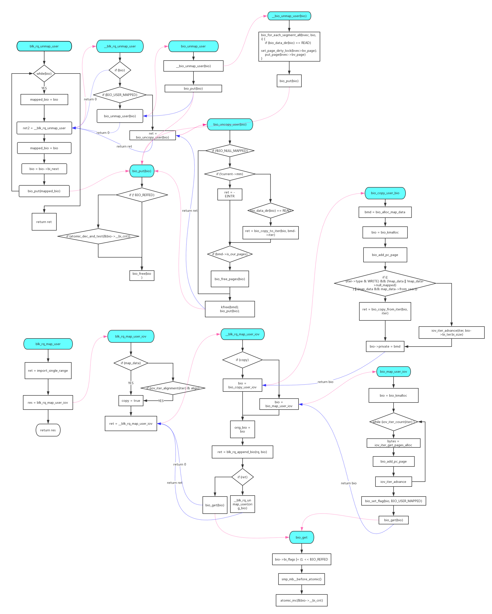

## Summary
This USE_AFTER_FREE error only exists version 1.1 infer analysis.

##  Error Location
```c
// In file block/blk-map.c
179 int blk_rq_unmap_user(struct bio *bio)
180 {
181     struct bio *mapped_bio;
182     int ret = 0, ret2;
183 
184     while (bio) {
185             mapped_bio = bio;
186             if (unlikely(bio_flagged(bio, BIO_BOUNCED)))
187                     mapped_bio = bio-bi_private;
188 

block/blk-map.c:194: error: USE_AFTER_FREE
  pointer `bio` was freed by call to `__blk_rq_unmap_user()` at line 189,
  column 10 and is dereferenced or freed at line 194, column 9.

189             ret2 = __blk_rq_unmap_user(mapped_bio);
190             if (ret2 && !ret)
191                     ret = ret2;
192 
193             mapped_bio = bio;
194  >          bio = bio->bi_next;
195             bio_put(mapped_bio);
196     }
197 
198     return ret;
199 }
```


## Analysis
This one is in a complex situation. the function `__blk_rq_unmap_user()` will
call `bio_put` which will call `bio_free` to release bio structure.

But the problem is that each `bio_put` will test the bio reference counter `bio->__bi_cnt` to make sure no one uses the bio and then release it. According to the invocation path, there will be two to three `bio_put` invocations.

```c
/**
 * bio_put - release a reference to a bio
 * @bio:   bio to release reference to
 *
 * Description:
 *   Put a reference to a &struct bio, either one you have gotten with
 *   bio_alloc, bio_get or bio_clone_*. The last put of a bio will free it.
 **/
void bio_put(struct bio *bio)
{
	if (!bio_flagged(bio, BIO_REFFED))
		bio_free(bio);
	else {
		BIO_BUG_ON(!atomic_read(&bio->__bi_cnt));

		/*
		 * last put frees it
		 */
		if (atomic_dec_and_test(&bio->__bi_cnt))
			bio_free(bio);
	}
}
```

The corresponding function `bio_get` will do atomic increasing on bio
reference counter. 

```c
/*
 * get a reference to a bio, so it won't disappear. the intended use is
 * something like:
 *
 * bio_get(bio);
 * submit_bio(rw, bio);
 * if (bio->bi_flags ...)
 *	do_something
 * bio_put(bio);
 *
 * without the bio_get(), it could potentially complete I/O before submit_bio
 * returns. and then bio would be freed memory when if (bio->bi_flags ...)
 * runs
 */
static inline void bio_get(struct bio *bio)
{
	bio->bi_flags |= (1 << BIO_REFFED);
	smp_mb__before_atomic();
	atomic_inc(&bio->__bi_cnt);
}
```

When `bio` was created, the reference counter `bio->__bi_cnt` will be initialized as `1`. As depicted in the diagram, `bio_unmap_user` will call 3 times of `bio_put`, as for `bio_uncopy_user`, there are 2 times invocation.

The corresponding `bio_map_user` will call 2 extra `bio_get` and for `bio_copy_user`, it's 1 extra calling.

Take the inital value into account, they match with each other.



## Conclusion
Kernel code, False Positive.


